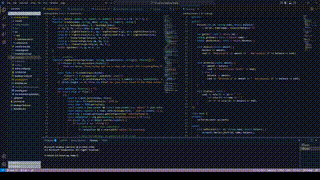

# Rotating Theme

**Rotating Theme** is a VS Code extension that smoothly rotates your IDE's color themes or custom palettes. Instead of switching instantly, it can fade between themes or user-defined color palettes over time, giving a dynamic and visually appealing coding experience.

---

## Features

- Automatically cycles through a folder of JSON color palettes.
- Smoothly fades between palettes with configurable transition duration and steps.
- Optionally skip `editor.*` colors to avoid interfering with code visibility.
- Manual commands to start, stop, or skip to the next palette immediately.
- Customizable whitelist of color keys to animate.
- Configurable dwell time between palette transitions.

> Tip: Use your own `.json` palette files in alphabetical order for unique color rotations!

---

## Requirements

- VS Code or VSCodium
- Node.js and npm installed (for development / compilation)
- Optional: JSON color palette files in a folder if using custom palettes.

---

## Extension Settings

This extension adds the following settings (accessible in `Settings > Extensions > Rotating Theme`):

* `rotatingTheme.themeFolder`: Absolute path to a folder containing JSON palette files. Files are rotated alphabetically.
* `rotatingTheme.transitionDurationMs`: Duration of the fade between palettes in milliseconds. Default: `1500`.
* `rotatingTheme.transitionSteps`: Number of steps within each fade. More steps = smoother transitions. Default: `30`.
* `rotatingTheme.dwellMs`: How long to stay on a palette before transitioning to the next (milliseconds). Default: `4000`.
* `rotatingTheme.keysWhitelist`: Optional list of color keys to animate. Leave empty to animate all keys found.
* `rotatingTheme.skipEditorColors`: If true, will ignore all `editor.*` colors to avoid affecting code files. Default: `true`.

---

## Commands

Available commands (via Command Palette `Ctrl+Shift+P` / `Cmd+Shift+P`):

- **Rotating Theme: Start** — Start the palette rotation.
- **Rotating Theme: Stop** — Stop rotation and restore original colors.
- **Rotating Theme: Next Now** — Immediately switch to the next palette.

---

## Known Issues

- Heavy usage of large palettes may cause minor UI lag.
- Some extensions that heavily override `workbench.colorCustomizations` may conflict with palette rotations.
- Currently only supports themes defined via JSON color keys.
- Text blinking when rotation active on javascript and typescript, this can be solved by adding `"editor.semanticHighlighting.enabled": false` to settings.json

---

## Release Notes

### 1.0.0
- Initial release with smooth palette rotation, configurable transitions, and optional editor color exclusion.

---

## More Information

- [Extension Guidelines](https://code.visualstudio.com/api/references/extension-guidelines)
- [Visual Studio Code Markdown Support](http://code.visualstudio.com/docs/languages/markdown)
- [Markdown Syntax Reference](https://help.github.com/articles/markdown-basics/)

**Enjoy your dynamic VS Code environment!**

readme.md generated by GPT because I am very lazy.